# Change Point Detection in Time Series Sensor data

This developer journey is intended for any Developer who wants to experiment, learn, enhance and implement a new method for Statistically detecting Change point in Sensor data. Sensors mounted on devices like IoT devices, Automated manufacturing like Robot arms, Process monitoring and Control equipment etc., collect and transmit data on a continuous basis which is Time stamped. 
This journey takes you through end to end flow of steps in collating statistics on such Time series data and identify if a Change point has occurred. Core building blocks would include computing Statistical parameters from the Time series data, which compares a Previous dataset of a certain Time range in the past with the Current Series in a recent Time range. Statistical comparison between these two results in detection of any change points. R statistical software is used in this Journey with sample Sensor data loaded into the Data Science experience cloud.
All the intermediary steps are modularized and all code open sourced to enable developers to use / modify the modules / sub-modules as they see fit for their specific application.

This journey utilizes IoT sensor data and its primary goal is to statistically identify the change point in this sensor data rather than the acquisition and storage of the data itself. For sake of completeness of the flow, a simulation of the IoT data acquisition is included as a first step.

A detailed journey of acquisition and storage of IoT sensor data is already covered extensively elsewhere. References to the details of these journeys are also given.

When you have completed this journey, you will understand how to

* Write data from a IoT source to a database
* Create and Run a Jupyter Notebook in DSX
* Run R statistical software code in Jupyter Notebook
* Read data from database in R notebook and statistically analyze the data
* Generate results in the form of visualisation plots
* Execute R statistical functions to detect Change point in data
* Output and save results in DSX Jupyter Notebook

This journey can be logically split into 2 major parts:
* Data acquisition and storage of IoT Sensor data using Node Red flows and DB2: The Steps 1 to 4 below cover the details of this part of the journey. 
* Data retrieval and statistical analysis using R - Jupyter notebooks to analyze and detect change points in the data:  The Steps 5 to 8 below cover the details of this part of the journey. 

#### Steps:
1.	Log into Bluemix and create Bluemix services  
2.	Create Node-RED Application to load IoT data into DB2 table by using the provided [.json configuration file](configuration/node-red.json)  
3.	Read IoT data from the sample csv file provided. The Node-RED flow can be changed to read from IoT devices directly  
4.	Import the [sample data](data/sample_sensordata2016_1s3dys.csv) into a DB2 table using the Node-RED flow  
5.	User configures the parameters in [.json dsx configuration file](configuration/cpd_dsx_config.json) that will be used in Data Science experience and updates credentials to read the configuration file  
6.	In R notebook flow,  user then updates credentials to read relevant Sensor data subset from the DB2 table. Data from the cloud database will be read by R Spark dataframe in DSX notebook. The user will further extract the 2 series of datasets to be compared. R notebook will use open R libraries and Custom built function components to get the statistics computed.User will generate visual comparison charts to get visual insights on changes in behavior of the sensor values. These Statistical metrics will be compared and the changes analyzed using the Custom functions written in R  
7.	In Data science experience R runs on Spark engine to ensure scalability and performance  
8.	Object storage is used to store the configuration file where DSX reads the parameters from. The results can also be stored in Object storage if needed  

Developer can reuse all components that support the above steps like
*	Reading specific Time series data points from database like Time stamp, Sensor ID, Sensor values
*	Time stamp conversion functions, filtering data for specific sensor
*	User configurable Time ranges for Splitting Time series data into 2 sets for comparison
*	Computations of key statistics that statistically compress these series for useful comparison
*	Build a dictionary of statistics to consistently compare these data sets
*	Based on threshold specified by User, detect if a Change point has occurred in the data

## Included components

* [IBM Node-RED Cloud Foundry App](https://console.bluemix.net/catalog/starters/node-red-starter): Develop, deploy, and scale server-side JavaScript® apps with ease. The IBM SDK for Node.js™ provides enhanced performance, security, and serviceability.

* [IBM Data Science Experience](https://www.ibm.com/bs-en/marketplace/data-science-experience): Analyze data using RStudio, Jupyter, and Python in a configured, collaborative environment that includes IBM value-adds, such as managed Spark.

* [DB2 Warehouse on cloud](https://console.bluemix.net/catalog/services/db2-warehouse-on-cloud): IBM Db2 Warehouse on Cloud is a fully-managed, enterprise-class, cloud data warehouse service. Powered by IBM BLU Acceleration.

* [Bluemix Object Storage](https://console.ng.bluemix.net/catalog/services/object-storage/?cm_sp=dw-bluemix-_-code-_-devcenter): A Bluemix service that provides an unstructured cloud data store to build and deliver cost effective apps and services with high reliability and fast speed to market.

* [Internet of Things Platform](https://console.bluemix.net/catalog/services/internet-of-things-platform): This service is the hub for IBM Watson IoT and lets you communicate with and consume data from connected devices and gateways. Use the built-in web console dashboards to monitor your IoT data and analyze it in real time.

## Featured technologies

* [Jupyter Notebooks](http://jupyter.org/): An open-source web application that allows you to create and share documents that contain live code, equations, visualizations and explanatory text.

# Watch the Video

# Steps

Follow these steps to setup and run this developer journey. The steps are
described in detail below.

1. [Sign up for the Data Science Experience](#1-sign-up-for-the-data-science-experience)
1. [Create Bluemix services](#2-create-bluemix-services)
1. [Create Node-RED App and inject IoT data](#3-create-node-red-app-and-inject-iot-data)
1. [Create the notebook](#4-create-the-r-spark-jupyter-notebook)
1. [Add the data and configuraton file](#5-add-the-configuration-and-data-access-details)
1. [Run the notebook](#6-run-the-notebook)
1. [Download the results](#7-view-the-results)

## 1. Sign up for the Data Science Experience

Sign up for IBM's [Data Science Experience](http://datascience.ibm.com/). By signing up for the Data Science Experience, two services: ``DSX-Spark`` and ``DSX-ObjectStore`` will be created in your Bluemix account.

## 2. Create Bluemix services

Create the Bluemix services by following the links below.
  * [**Object Storage in Bluemix**](https://console.ng.bluemix.net/catalog/services/object-storage)  
    
    1. Choose an appropriate name for the service `Service Name` and choose `Free` Pricing Plan. Click on `Create`.
        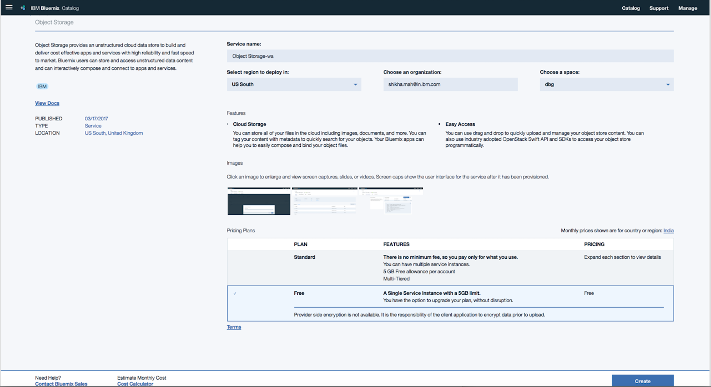
         
    2. Click on Object Storage service instance on Bluemix Dashboard. Choose the `region` and create a Container unit using `Add a container` link.
        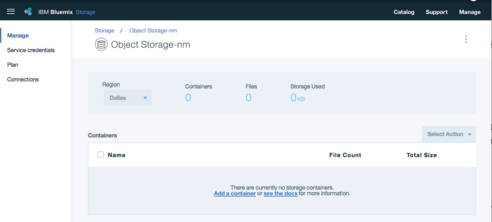
         
    3. Upload the [sample data file](data/sample_sensordata2016_1s3dys.csv) in Object storage Container.
    
    
  * [**DB2 Warehouse on Cloud**](https://console.bluemix.net/catalog/services/db2-warehouse-on-cloud)

    

    1. Once service is created, click on `DB2 Warehouse on Cloud` service instance on Bluemix Dashboard. Click `Open` to launch the Dashboard.
    2. Click on `Explore` from the panel, choose schema and then create a `New Table`.
       
    3. Create a new database table `CHANGEPOINTIOT` with following schema:  
          {  
                SENSORID VARCHAR(20)  
                TIMESTAMP VARCHAR(100)  
                SENSORVALUE DECIMAL(8,5)  
                SENSORUNITS VARCHAR(100)   
          }

  * [**Internet of Things Platform**](https://console.bluemix.net/catalog/services/internet-of-things-platform)

    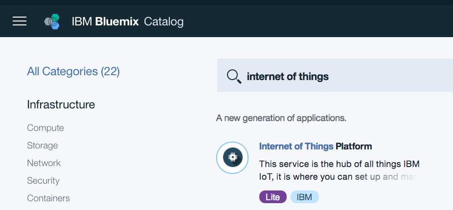

    1. Once service is created, click on `Internet of Things Platform` service instance on Bluemix Dashboard. Launch the Watson IoT Platform Dashboard.    
    2. Register a device on Watson IoT Platform, refer to step 3 and step 4 in https://developer.ibm.com/recipes/tutorials/how-to-register-devices-in-ibm-iot-foundation/  
    3. Generate API Keys to establish a connection to IoT Platform from your application. Refer step 5 in https://developer.ibm.com/recipes/tutorials/how-to-register-devices-in-ibm-iot-foundation/ to generate API Keys. Make a note of the generated keys, it will be used later.

  * [**Data Science Experience**](https://console.bluemix.net/catalog/services/data-science-experience)

  
  

 
## 3. Create Node-RED App and inject IoT data

Create the Node-RED Starter application by following the link. Choose an appropriate name for the Node-RED application - `App name:`. Click on `Create`.

 [**Node-RED Starter**](https://console.bluemix.net/catalog/starters/node-red-starter)

  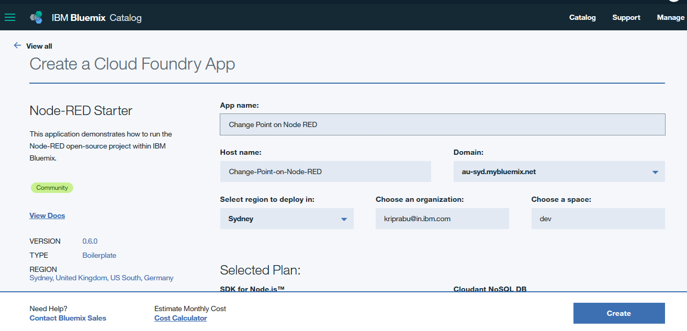

  * On the newly created Node-RED application page, Click on `Visit App URL` to launch the Node-RED editor once the   application is in `Running` state.
  * On the `Welcome to your new Node-RED instance on IBM Bluemix` screen, Click on `Next`
  * On the `Secure your Node-RED editor` screen, enter a username and password to secure the Node-RED editor and click on `Next`
  * On the `Browse available IBM Bluemix nodes` screen, click on `Next`
  * On the `Finish the install` screen, click on Finish
  * Click on `Go to your Node-RED flow editor` 
  * Install the following nodes before importing the flow. To do this select ‘Manage Palette’ from the menu (top right), and then select the install tab in the palette. Search for new nodes name to install and click on install.
  
    - `node-red-contrib-objectstore`
    
      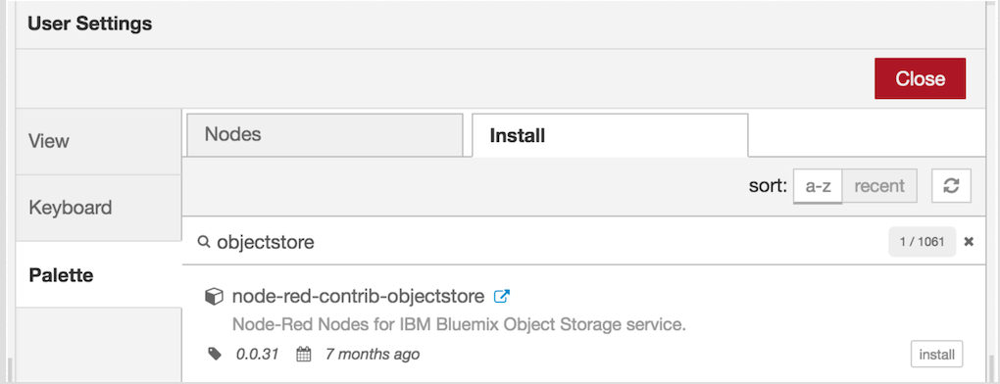
       
    - `node-red-contrib-ibm-watson-iot`
    
      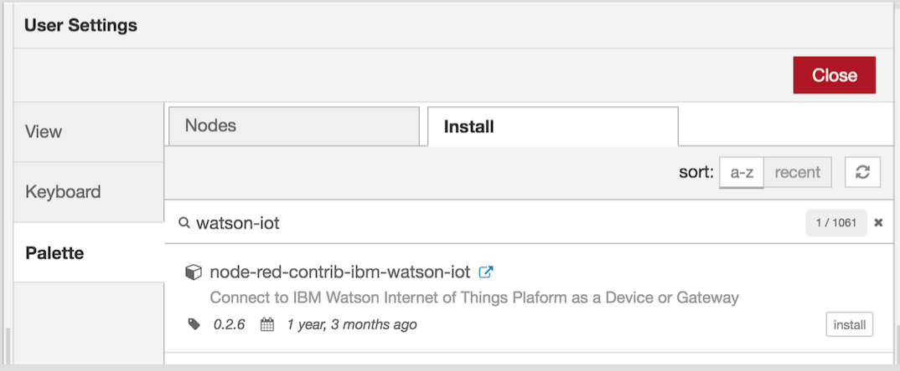

#### Import Node-RED flow by importing the [configuration .json](configuration/node-red.json)  
The flow json for Node-RED can be found under `configuration` directory. 
* Download the `configuration/node-red.json`
* Open the file with a text editor and copy the contents to Clipboard
* On the Node-RED flow editor, click the Menu and select Import -> Clipboard and paste the contents

  
 
#### Adjustments to the node properties in Node-RED Flow 
1.	Object Storage node (getFileData_in_buffer): Provide your Object Storage service credentials. Service credentials are available in Bluemix service instance. Configure node in buffer mode to read the file from your object storage service. Ensure the sample data is loaded into Object storage as explained in Create Bluemix Services section above.

2.	Watson-IoT node (TemperatureSensor): Configure this with a registered device on Watson IoT Platform. To configure Watson IoT node in node-red, refer to : https://developer.ibm.com/recipes/tutorials/simulating-a-device-and-publishing-034messages034-to-ibm-iot-platform-from-a-nodered-034watson-iot034-platform-node/

3.	IBM IoT node: Configure IBM IoT node to receive events from Watson IoT Platform using the API keys generated in Create Bluemix Services section. To setup IBM IoT Node in node-red refer to step 5 in https://developer.ibm.com/recipes/tutorials/getting-started-with-watson-iot-platform-using-node-red/

4.	dashDB node (CHANGEPOINTIOT): Use credentials of DB2 Warehouse on Cloud service. Service credentials are available in Bluemix service instance. Provide database table name `CHANGEPOINTIOT` in which sensor data will get populated.

 #### Deploy the Node-RED flow by clicking on the `Deploy` button

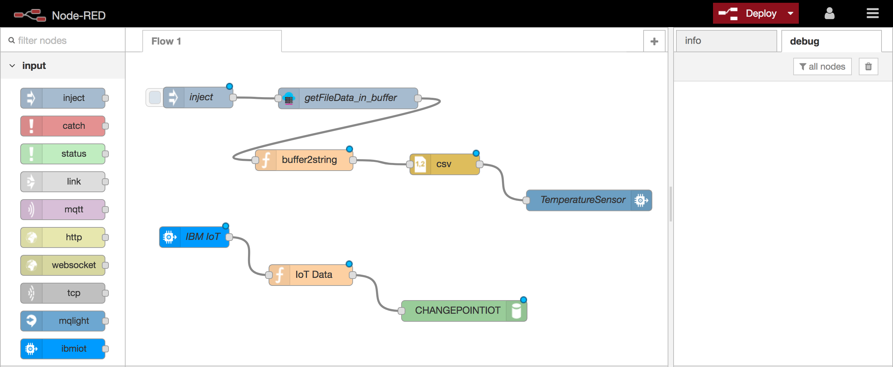
 

Node-red flow is designed as:  
 1.	The csv file with sample sensor data is uploaded in object storage.
 2.	Prepare a csv string from the sample data file and give this string, as an input  to csv node.
 3.	csv node will act as a device simulator and it will trigger an event of temperature sensor for each row of data.
 4.	The events sent by temperature sensor will be received by IBM IoT Platform.
 5.	This data will be prepared and then stored in the database.
 6.	Data from DB can be used in R Jupyter notebook for analytics.
  
  
 #### Inject the data in Node-RED Flow
  In Node-RED Flow, click on the input of `inject` node. It will trigger the execution of the node-red flow and on successful execution, data will get stored to DB2 table `CHANGEPOINTIOT`.

## 4. Create the R Spark Jupyter notebook

Use the menu on the left to select `My Projects` and then `Default Project`.
Click on `Add notebooks` (upper right) to create a notebook.

* Select the `From URL` tab.
* Enter a name for the notebook.
* Optionally, enter a description for the notebook.
* Enter this Notebook URL:  
  https://github.com/IBM/detect-timeseriesdata-change/blob/master/notebooks/watson_changepoint_detection.ipynb
* Click the `Create Notebook` button.

  
* Upload the sample .json DSX configuration file to Object storage from URL:  
  https://github.com/IBM/detect-timeseriesdata-change/blob/master/configuration/cpd_dsx_config.json

## 5. Add the configuration and data access details

#### Fix-up configuration parameter .json file name and values

Once the files have been uploaded into ``DSX-ObjectStore`` you need to update the variables that refer to the .json configuration files in the R - Jupyter Notebook.

In the notebook, update the DSX configuration .json file name in section 2.1.1 

Edit the [DSX configuration .json file](configuration/cpd_dsx_config.json)  
Update the `paramvalue` ONLY to suit your requirements and save the .json file  
Retain the rest of the format and composition of the .json file  

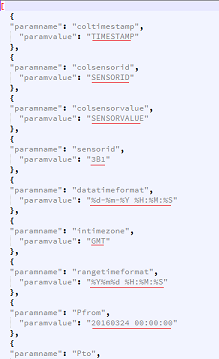

The descriptions of the parameters that can be configured are as below.
1. coltimestamp: Name of the column which holds the Time stamp of data 
  recorded by Sensor
2. colsensorid: Name of the column which holds the Sensor identification
3. colsensorvalue: Name of the column that stores the values measured by sensor
4. sensorid: Sensor ID for which the analysis needs to be applied
5. datatimeformat: Time format of the data in the data frame
6. intimezone: Time zone for the Time stamps
7. rangetimeformat: Time format which is used for specifying the time ranges
8. Pfrom: Start Time for first series Time range
9. Pto: End Time for first series Time range
10. Cfrom: Start Time for second series Time range
11. Cto: End Time for second series Time range
12. thresholdpercent: Set the threshold percentage of change if detected

* In section 2.1.2 of DSX notebook, Insert (replace) your own Object storage 
file credentials to read the .json configuration file
* Also replace the function name in the block that Read json configuration file
in section 2.1.3

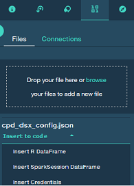
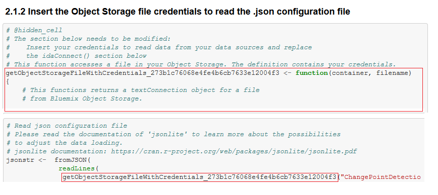

#### Add the data and configuration to the notebook
Use `Find and Add Data` (look for the `10/01` icon)
and its `Connectsions` tab. You must be able to see your database connection created earlier.
From there you can click `Insert to Code` under the 'Data connection' list and add ibm DBR code
with connection credentials to the flow.

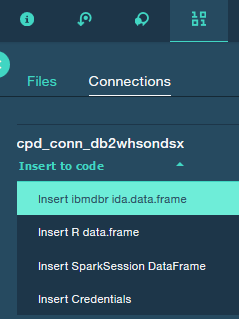

> Note:  If you don't have your own data and configuration files, you can reuse our example in the "Read IoT Sensor data from database"
section. Look in the `data/sensordata2016_1s3dys.csv` directory for data file.

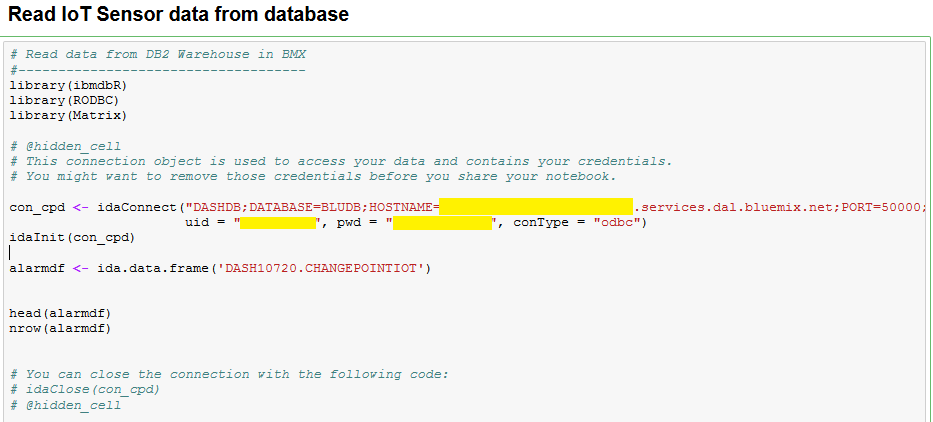

## 6. Run the notebook

When a notebook is executed, what is actually happening is that each code cell in
the notebook is executed, in order, from top to bottom.

Each code cell is selectable and is preceded by a tag in the left margin. The tag
format is `In [x]:`. Depending on the state of the notebook, the `x` can be:

* A blank, this indicates that the cell has never been executed.
* A number, this number represents the relative order this code step was executed.
* A `*`, this indicates that the cell is currently executing.

There are several ways to execute the code cells in your notebook:

* One cell at a time.
  * Select the cell, and then press the `Play` button in the toolbar.
* Batch mode, in sequential order.
  * From the `Cell` menu bar, there are several options available. For example, you
    can `Run All` cells in your notebook, or you can `Run All Below`, that will
    start executing from the first cell under the currently selected cell, and then
    continue executing all cells that follow.
* At a scheduled time.
  * Press the `Schedule` button located in the top right section of your notebook
    panel. Here you can schedule your notebook to be executed once at some future
    time, or repeatedly at your specified interval.

## 7. View the results

The notebook outputs the results in the Notebook which can be copied to clipboard

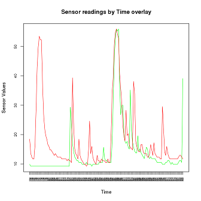

The graphs give a visual indication of how the Sensor values behave during the 2 time periods  

Statistics on these 2 time periods like averages, standard deviations, quartiles are computed and deviations computed for each of them. Then a overall deviation is computed and compared against the threshold set earlier in the DSX configuration file  

Based on the threshold deviation specified by the user, if the overall computed deviation exceeds the threshold configured, custom R functions will output if there is a Change point occurrence detected  

# Troubleshooting

[See DEBUGGING.md](DEBUGGING.md)

# License

[Apache 2.0](LICENSE)
